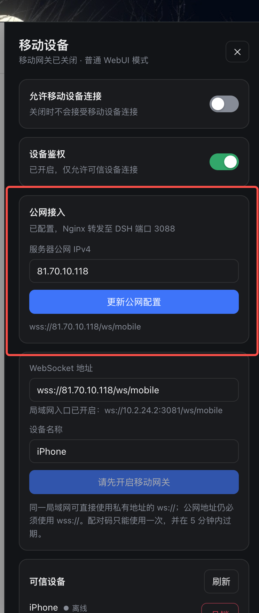

<p align="center">
  
</p>

# dsh-plugin-weapp-gateway

DeepSeek Harness 的设备鉴权移动网关，支持会话与实时事件、排队消息同步及编辑/删除/Steer、Session 归档和重命名的双向同步、停止当前生成并稍后继续、任务列表和当前 Goal 同步及管理、服务端驱动的命令和技能菜单、Human-in-the-loop、图片及文件传输。安装后，Harness WebUI 左侧边栏会出现“移动设备”入口，可直接开启网关、生成配对二维码和管理可信设备。

> 当前源码以 **DSH 0.1.5-rc.2** 为唯一适配基线，使用 Session format 3；不再兼容更早的 Host 版本。
>
> 实时流已改为独立 `assistant-stream` 帧，移动端需要按 [rc.2 接入说明](docs/dsh-rc2-mobile-integration.md) 更新订阅、缓存与分页处理。当前修改尚未发布。
>
> v0.7.3：优化移动网关运行模式下拉框的箭头间距。
>
> v0.7.2：新增独立对话/控制连接、空 Session 创建、停止生成与稍后继续、排队消息同步及编辑/删除/Steer，以及 Session 归档和重命名的双向同步。

## 协议与 DSH 兼容层

移动端连接的是本项目维护的 `dsh-mobile-v1`，不是 DSH 的内部 Remote 协议。插件内部通过独立 Host Adapter 对接 DSH 0.1.5-rc.2 的 Remote Gateway；Session、Workspace、Settings、Commands、Goals 等 namespace 和严格参数只存在于该适配层。

配对鉴权和 `dsh-mobile-v1` / `hello.protocol = 3` 保持不变。新版实时 token 不占用持久事件的 `seq`：客户端显式订阅 `assistantStream: true`，接收原子的 `session-snapshot` 和独立增量；普通 `event` 只携带持久事件。未接入新订阅的客户端只能收到持久消息。

历史响应包含 `historyFormatVersion` 和 `cursor`。客户端格式变化时应清理历史缓存、重新安装基线；携带 `beforeSeq` 的分页或携带 `atSeq` 的 fork 必须同时发送 `historyFormatVersion: 3`。
当前协议接入与验收见 [rc.2 移动端接入说明](docs/dsh-rc2-mobile-integration.md)；早期迁移记录见 [Remote Gateway 重构实施计划](docs/remote-gateway-refactor-plan.md)。

- WebSocket：`/ws/mobile`
- 局域网：`ws://<局域网 IP>:3081/ws/mobile`
- Linux 服务器公网：`wss://<公网 IP>/ws/mobile`
- 协议文档：[PROTOCOL.md](PROTOCOL.md)

当前源码新增会话模式选择：App 创建空白 Session 后，可查询并修改该 Session 的 Agent preset；首次对话后锁定。通过 `session-agent-preset` 能力发现接入，详见 [App 接入说明](docs/session-agent-preset-app-integration.md)。App 界面需按此说明接入，本次源码尚未发布。

## 多网关第一阶段（当前源码）

插件提供稳定 `gatewayId`、可配置 `gatewayName`、配对候选地址列表，以及可持久化的“关闭 / 临时开启 / 常驻开启”运行模式。一个 App 可以分别配对不同机器上的网关；客户端多网关管理仍需按 [App 对接说明](docs/multi-gateway-app-integration.md) 实现。本次源码尚未发布新的 npm 版本。

在“移动设备”面板选择“常驻开启”，网关会持续接受已授权设备连接，重启后保持。常驻需要 DSH 进程运行、机器未休眠且网络可达，不提供自动发现或网络中转。

部署配置示例（对应 mobile-gateway 插件的 `config`）：

```yaml
gatewayMode: persistent
gatewayName: 家里电脑
requireAuth: true
endpoints:
  - wss://gateway.example.com/ws/mobile
  - ws://192.168.1.10:3081/ws/mobile
```

运行模式的优先级：**已保存的界面选择 > `gatewayMode` > 旧 `gatewayEnabled`**。没有保存选择时，旧配置 `gatewayEnabled: true` 对应常驻，false 对应关闭。

- 关闭：立即断开移动连接，重启后仍关闭。
- 临时开启：默认 5 分钟没有设备成功连接则关闭并保存关闭状态；成功连接后本次运行保持开启。若以临时模式重启，则重新开始等待首次连接。`gatewayWaitTimeoutMs` 可配置 30 秒至 30 分钟。
- 常驻开启：没有无人连接关闭计时器。配对码仍默认 5 分钟过期，文件传输超时等独立规则不变。

状态默认保存到 `<deviceFile>.gateway.json`，通常为 `~/.dsh/mobile-gateway-devices.json.gateway.json`；可通过 `gatewayStateFile` 单独配置。文件包含随机 UUID v4 身份及用户选择，权限为 `0600`，使用同目录临时文件原子替换；损坏时启动报错，不能静默生成新身份。每个运行实例必须使用独立的设备注册文件和状态文件。

升级和迁移机器时应一并保留这两个文件。克隆为新的独立网关时，不复制原实例的状态文件和设备注册文件，让新实例生成新身份并重新配对。不要在运行中删除身份文件来恢复默认模式；如需重新使用启动配置，应停止该实例、备份状态文件、仅将其 `mode` 改为 `null`，保留 `version` 和 `gatewayId` 后重启。

`gatewayName` 最多 80 字符，未设置时使用主机名。`endpoints` 是额外候选地址，最多 16 项，每项最多 2048 字符；配对时还会合并首选地址、公网配置与已监听的 LAN 地址，合并超过 16 项会报错。所有地址必须指向同一网关；不得填写 `0.0.0.0` / `::`。地址需要手机实际可达，公网使用 WSS。

测试结果与人工步骤见 [验收报告](docs/multi-gateway-phase1-acceptance.md)，完成范围见 [多网关待办](docs/multi-gateway-todo.md)。

## 配套 iOS 客户端

[DeepSeek Harness Mobile](https://github.com/Clarklevis1995/dsh-mobile) 是本仓库的兄弟项目。它是面向 iOS 17+ 的 SwiftUI 原生客户端，支持工作区与会话、工作区内创建文件夹、历史和实时对话、图片、Agent 执行轨迹、Human-in-the-loop，以及由网关配置驱动的命令、技能、模型与权限菜单。

<table>
  <tr>
    <td width="33.33%" align="center"></td>
    <td width="33.33%" align="center"></td>
    <td width="33.33%" align="center"></td>
  </tr>
  <tr>
    <td align="center"><strong>工作区首页</strong></td>
    <td align="center"><strong>实时对话</strong></td>
    <td align="center"><strong>设备配对</strong></td>
  </tr>
</table>

## 安装插件

前提：已经安装 `dsh` CLI 和 `pnpm`，并能正常启动 `dsh web`。可先执行 `pnpm --version` 确认当前用户的环境能够找到 `pnpm`。

局域网使用只需安装插件：

```bash
dsh plugin --profile web add dsh-plugin-weapp-gateway@latest
```

需要在 Linux 服务器通过公网 IP 接入时，推荐执行统一初始化命令。它会安装/更新插件，并请求一次 sudo 权限安装系统 Helper：

```bash
npx --yes dsh-plugin-weapp-gateway@latest init
```

`init` 会把当前正在执行的 npm 包精确版本安装到 DSH profile，并仅对该版本跳过 pnpm 的新版本等待期，确保插件与 Helper 版本一致。

安装后停止并重新启动 WebUI：

```bash
dsh web
```

打开 WebUI，确认左侧边栏底部出现“移动设备”。

## 局域网配对

适用于 DSH 电脑和 iPhone 位于同一个可互访的局域网。

1. 打开 WebUI 的“移动设备”。
2. 将“网关运行模式”设为“常驻开启”（短期配对也可选“临时开启”）。
3. 保持“设备鉴权”开启。
4. 确认面板显示 `ws://<电脑局域网 IP>:3081/ws/mobile`。
5. 填写设备名称并点击“生成配对二维码”。
6. 在 iOS 客户端打开“设备认证”，扫描二维码。
7. WebUI 的可信设备显示“在线”后即完成。

如果系统防火墙拦截连接，只允许私有网络访问 TCP `3081`。不要把 3081 开放到公网。

## Linux 服务器公网 IP 配对

> [!NOTE]
> 本文所说的“公网 IP 配对”特指 Linux 服务器。一键公网安装从 `v0.6.4` 开始提供，适用于带固定公网 IPv4 的 Ubuntu/Debian 服务器。服务器需要已经安装 Node.js、`pnpm` 和 `dsh` CLI；当前尚不支持 CentOS。

### 1. 准备公网端口

在云厂商控制台复制服务器的公网 IPv4，并在安全组中放行入站 TCP `80` 和 `443`。不要将 DSH WebUI 端口或 TCP `3081` 开放到公网。

### 2. 一键初始化

先确认普通 DSH 用户可以直接调用 `pnpm`：

```bash
pnpm --version
```

然后使用同一个普通用户执行（不要使用 `root` 或 `sudo npx`）：

```bash
npm_config_registry=https://registry.npmjs.org \
npx --yes dsh-plugin-weapp-gateway@latest init
```

该命令会安装或更新插件，并请求一次 sudo 权限安装 Nginx、Certbot、系统 Helper 和证书续期定时器。`init` 会确保 DSH profile 与 Helper 使用同一个精确版本。

完成后启动或重新启动 WebUI：

```bash
dsh web
```

### 3. 打开远程 WebUI

优先使用 VS Code、Cursor 等 IDE 自带的端口转发。也可以在自己的电脑执行：

```bash
ssh -N -L <本地端口>:127.0.0.1:<DSH 实际端口> <服务器用户名>@<服务器公网 IP>
```

然后在本地浏览器打开：

```text
http://127.0.0.1:<本地端口>
```

### 4. 在 UI 配置公网入口

打开左侧的“移动设备”，在“公网接入”填写云厂商控制台提供的公网 IPv4，然后点击“配置公网接入”或“更新公网配置”。Helper 会自动读取当前 `dsh web` 端口并配置 Nginx、TLS 证书和 `wss://<公网 IP>/ws/mobile`。

<p align="center">
  
</p>

### 5. 配对移动设备

1. 开启“允许移动设备连接”，保持“设备鉴权”开启。
2. 填写设备名称并点击“生成配对二维码”。
3. iPhone 打开“设备认证”并扫描二维码。
4. WebUI 的可信设备显示“在线”后即完成。

二维码只能使用一次，并会在 5 分钟后过期；超时后在 WebUI 重新生成即可。

## Windows / macOS 家用电脑远程连接

家用电脑通常没有固定公网 IP，不建议配置路由器端口转发。可以使用 Tailscale 长期连接，或使用 Cloudflare Quick Tunnel 临时调试。两种方式都转发到插件专用的 `3081` 端口，不会公开 DSH WebUI。

使用前先启动 `dsh web`，并在“移动设备”面板开启“允许移动设备连接”和“设备鉴权”。

### Tailscale（推荐长期使用）

1. 在电脑和 iPhone 安装 [Tailscale](https://tailscale.com/download)，并登录同一个 Tailnet。
2. 在 Windows PowerShell 或 macOS 终端执行：

```bash
tailscale serve --bg 3081
```

3. 执行 `tailscale serve status` 查看生成的 `https://<设备名>.<tailnet>.ts.net` 地址。
4. 将地址改为 `wss://<设备名>.<tailnet>.ts.net/ws/mobile`，填入 WebUI 的“WebSocket 地址”，再生成二维码配对。

Tailscale Serve 只允许同一 Tailnet 中符合访问规则的设备连接，并自动提供 HTTPS。可用 `tailscale serve reset` 停止转发。参见 [Tailscale Serve 文档](https://tailscale.com/docs/reference/tailscale-cli/serve)。

### Cloudflare Quick Tunnel（仅临时调试）

1. 安装 [cloudflared](https://developers.cloudflare.com/cloudflare-one/networks/connectors/cloudflare-tunnel/downloads/)。
2. 在 Windows PowerShell 或 macOS 终端执行：

```bash
cloudflared tunnel --url http://127.0.0.1:3081
```

3. 命令行会显示随机的 `https://<随机名称>.trycloudflare.com` 地址。
4. 将地址改为 `wss://<随机名称>.trycloudflare.com/ws/mobile`，填入 WebUI 的“WebSocket 地址”，再生成二维码配对。

保持该命令运行；停止命令后隧道立即失效。Quick Tunnel 的地址每次可能变化，且没有可用性保证，不适合正式或长期使用。公网调试时必须保持“设备鉴权”开启。参见 [Cloudflare Quick Tunnel 文档](https://developers.cloudflare.com/cloudflare-one/networks/connectors/cloudflare-tunnel/do-more-with-tunnels/trycloudflare/)。

## 网关配置方式总览

| 使用场景 | 推荐入口 | iOS WebSocket 地址 | 需要的额外配置 | 端口与鉴权 |
|---|---|---|---|---|
| 同一局域网 | 插件局域网入口 | `ws://<电脑局域网 IP>:3081/ws/mobile` | 无需 Helper 或 Nginx；电脑与 iPhone 位于可互访的局域网 | 仅对私有网络放行 TCP `3081`；保持鉴权开启 |
| 本机 iOS 模拟器 | DSH WebUI 本地入口 | `ws://127.0.0.1:<DSH WebUI 端口>/ws/mobile` | 无需 Helper、Nginx 或独立的 `3081` 端口 | 不开放任何外部端口；仅 Debug 时可关闭鉴权 |
| Linux 公网服务器 | 插件 Helper + Nginx + TLS | `wss://<服务器公网 IPv4>/ws/mobile` | 执行 `init`，再从 WebUI 填写公网 IPv4 | 云安全组放行 TCP `80/443`；不要公开 DSH 端口和 `3081`；必须鉴权 |
| 家用 Windows / macOS | Tailscale Serve；临时调试可用 Quick Tunnel | `wss://<Tailscale 域名>/ws/mobile` 或 `wss://<随机名称>.trycloudflare.com/ws/mobile` | 隧道转发到 `127.0.0.1:3081`，将生成的地址填入 WebUI | 无需路由器端口转发；保持鉴权开启 |

## Linux 服务器公网入口管理

查看状态：

```bash
sudo env "PATH=$PATH" npx --yes dsh-plugin-weapp-gateway@latest status
```

移除公网入口：

```bash
sudo env "PATH=$PATH" npx --yes dsh-plugin-weapp-gateway@latest remove
```

## 更新插件

重新运行初始化命令会同时更新插件和系统 Helper：

```bash
npx --yes dsh-plugin-weapp-gateway@latest init
```

随后停止并重新启动 `dsh web`。

## 卸载插件

```bash
dsh plugin --profile web remove dsh-plugin-weapp-gateway
```

如需同时移除系统 Helper（不会删除现有 Nginx 公网配置）：

```bash
sudo env "PATH=$PATH" npx --yes dsh-plugin-weapp-gateway@latest remove-helper
```

## 常见问题

| 现象 | 处理方式 |
|---|---|
| WebUI 没有“移动设备” | 确认安装在 `web` profile，并完整重启 `dsh web` |
| iOS 收到 `503` | 回到 WebUI 开启“允许移动设备连接” |
| iOS 收到 `401` | 在 WebUI 重新生成二维码并配对 |
| Linux 服务器公网连接超时 | 检查云安全组、服务器防火墙和 TCP `80/443` |
| Linux 服务器公网地址没有显示 | 在“移动设备 → 公网接入”填写公网 IPv4 并点击更新 |
| 需要查看服务端日志 | 执行 `tail -f /tmp/mobile-gateway.log` |

## 源码开发

```bash
dsh plugin --profile web add file:/absolute/path/to/dsh-plugin-weapp-gateway
npm test
```

源码修改后需要重新安装插件并重启 `dsh web`。
